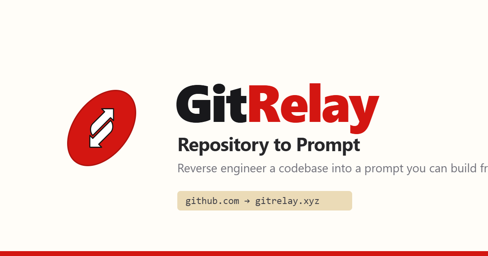
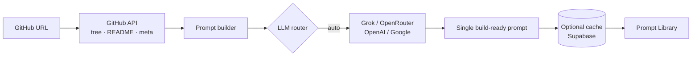

<div align="center">



<br/>

# GitRelay

**Reverse-engineer any GitHub repository into a prompt you can build from.**

Paste a repo URL — or just swap `hub` → `relay` — and get a single, clean,
ready-to-paste prompt for Cursor, Claude Code, or any AI coding agent.

<br/>

[](https://nextjs.org/)
[](https://react.dev/)
[](https://www.typescriptlang.org/)
[](https://tailwindcss.com/)
[](LICENSE)
[](CONTRIBUTING.md)

[**Live →  gitrelay.xyz**](https://gitrelay.xyz) · [Prompt Library](https://gitrelay.xyz/library) · [Report a bug](https://github.com/gitrelay-tech/gitrelay/issues/new/choose)

</div>

---

## ✨ The one-line trick

Take **any** GitHub URL and replace `hub` with `relay`:

```diff
- https://github.com/vercel/next.js
+ https://gitrelay.xyz/vercel/next.js
```

That's the whole UX. You instantly land on a generated prompt that describes the
project well enough for an AI agent to rebuild it.

---

## 🚀 What it does

You found a repo you love and want to build something like it. Instead of staring
at a blank prompt and describing an entire codebase by hand, GitRelay reads the
repository — file tree, README, structure, metadata — and asks an LLM to distill
it into a single conversational prompt.

| Mode | What it's for |
| --- | --- |
| ⚡ **Quick** | Instant prompt from any repo. The default. |
| 🔍 **Deep Reverse** | Goes deeper on large / complex projects for a richer prompt. |
| 🎛️ **Manual control** | Focus on one feature and shape the prompt yourself. |

---

## 🧠 How it works



1. **Fetch** — pull the repository's file tree, README and metadata via the GitHub API.
2. **Compose** — format that context into a structured prompt scaffold.
3. **Generate** — a provider-agnostic LLM router turns it into one clean prompt.
4. **Cache & share** — results can be cached in Supabase and surfaced in the public Prompt Library.

See [`docs/ARCHITECTURE.md`](docs/ARCHITECTURE.md) for the full breakdown.

---

## 🛠️ Tech stack

- **Framework:** Next.js 16 (App Router) + React 19
- **Language:** TypeScript 5
- **Styling:** Tailwind CSS 4
- **LLM providers:** xAI (Grok), OpenRouter, OpenAI, Google AI Studio — with an `auto` router
- **Optional services:** Supabase (caching + library + auth), Stripe (Premium)
- **Package manager:** pnpm

---

## ⚡ Getting started

> Requires Node.js 20+ and [pnpm](https://pnpm.io/).

```bash
# 1. Install dependencies
pnpm install

# 2. Configure environment
cp .env.example .env.local
#   → add at least one LLM API key (see below)

# 3. Run the dev server
pnpm dev
```

Open [http://localhost:3000](http://localhost:3000).

### Minimum configuration

GitRelay needs **at least one LLM API key**. Everything else is optional.

```ini
# Pick a provider explicitly, or leave unset for `auto`
GITRELAY_QUICK_LLM=google

# …and set the matching key (one is enough)
GOOGLE_GENERATIVE_AI_API_KEY=...
# OPENROUTER_API_KEY=...
# OPENAI_API_KEY=...
# XAI_API_KEY=...

# Required in production only
VIEWS_IP_SALT=<random 32-byte hex>
```

| Variable | Required | Purpose |
| --- | :---: | --- |
| `GITRELAY_QUICK_LLM` | – | Provider selector: `auto` (default), `grok`, `openrouter`, `openai`, `google` |
| One provider key | ✅ | `XAI_API_KEY` · `OPENROUTER_API_KEY` · `OPENAI_API_KEY` · `GOOGLE_GENERATIVE_AI_API_KEY` |
| `GITHUB_TOKEN` | – | Raises GitHub API rate limits |
| `SUPABASE_URL` / `SUPABASE_PUBLISHABLE_KEY` | – | Response caching, Prompt Library, auth |
| `STRIPE_SECRET_KEY` / `STRIPE_PRICE_ID` | – | Premium checkout |
| `VIEWS_IP_SALT` | prod | Hash salt for view counting (app refuses to boot in prod without it) |

---

## 📂 Project structure

```
gitrelay/
├── app/                    # Next.js App Router
│   ├── [owner]/[repo]/     # Shareable quick-reverse routes (+ /deep, /[focus], /tree)
│   ├── api/                # 12 route handlers (reverse-prompt, library, billing, admin…)
│   ├── library/            # Prompt Library
│   ├── premium/            # Pricing page
│   └── history/            # Recently viewed repos
├── components/             # React components (navbar, home, auth, library…)
├── contexts/               # React context providers (auth)
├── lib/                    # GitHub client, LLM router, prompt cache, helpers
├── scripts/                # Maintenance scripts (title/embedding backfill)
├── supabase/migrations/    # Database migrations
└── public/                 # Static assets & brand
```

### Key API routes

| Route | Description |
| --- | --- |
| `POST /api/reverse-prompt` | Quick reverse: repo → prompt |
| `POST /api/custom-reverse` | Deep / manual reverse |
| `GET  /api/library` | Browse cached prompts |
| `POST /api/increment-views` | View counting |
| `*    /api/*-subscription`, `/api/create-checkout` | Stripe billing |
| `POST /api/admin/backfill-*` | Admin maintenance (embeddings, titles) |

---

## 🗺️ Roadmap

- [ ] Per-language prompt templates
- [ ] One-click export to Cursor / Claude Code
- [ ] Repository diff → prompt ("what changed")
- [ ] Self-host guide & Docker image
- [ ] Browser extension for the `hub → relay` swap

---

## 🤝 Contributing

Contributions are welcome! Please read [`CONTRIBUTING.md`](CONTRIBUTING.md) and our
[Code of Conduct](CODE_OF_CONDUCT.md) before opening a PR.

## 🔒 Security

Found a vulnerability? Please follow [`SECURITY.md`](SECURITY.md) — do **not** open a public issue.

## 📄 License

[MIT](LICENSE) © GitRelay
