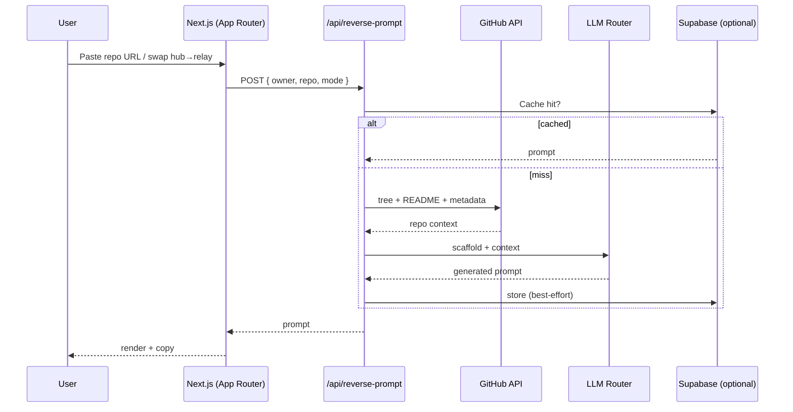

# Architecture

This document explains how GitRelay turns a GitHub URL into a single,
build-ready prompt.

## High-level flow



## Layers

### 1. Routing (`app/`)

The App Router exposes both a classic input form (`/`) and shareable dynamic
routes that mirror GitHub's own paths:

- `/[owner]/[repo]` — quick reverse
- `/[owner]/[repo]/deep` — deep reverse
- `/[owner]/[repo]/[focus]` — focused / manual reverse
- `/[owner]/[repo]/tree/[[...path]]` — path-aware entry

This is what makes the `github.com → gitrelay.xyz` swap work: the URL shapes are
intentionally identical.

### 2. GitHub client (`lib/github-client.ts`)

A thin wrapper over the GitHub REST API that fetches the repository tree, README,
and metadata. An optional `GITHUB_TOKEN` raises rate limits.

### 3. Prompt builder (`lib/system-prompt.ts`, `lib/file-tree-formatter.ts`)

Formats the raw repo context into a structured scaffold: a compact file tree, the
README, and project metadata, framed as instructions for the LLM.

### 4. LLM router (`app/api/reverse-prompt/route.ts`)

Provider-agnostic. `GITRELAY_QUICK_LLM` selects a provider explicitly, or `auto`
picks the first available key in priority order:

```
Grok (xAI) → OpenRouter → OpenAI → Google AI Studio
```

Each provider has its own model env (`XAI_MODEL`, `OPENROUTER_MODEL`, …).

### 5. Caching & library (`lib/supabase.ts`, `lib/prompt-cache-*.ts`)

When Supabase is configured, generated prompts are cached (keyed by repo + mode)
and surfaced in the public **Prompt Library** with titles and semantic-search
embeddings. View counts are hashed with `VIEWS_IP_SALT`.

### 6. Billing (`app/api/*-subscription`, `app/api/create-checkout`)

Stripe powers the Premium tier. All billing routes are optional and no-op when
Stripe env vars are absent.

## Failure modes

| Situation | Behaviour |
| --- | --- |
| No LLM key | `/api/reverse-prompt` returns a 4xx with setup guidance |
| Repo not found | 404 with a clear message |
| Supabase absent | Caching + library disabled; core flow still works |
| Stripe absent | Premium checkout shows "unavailable" |
